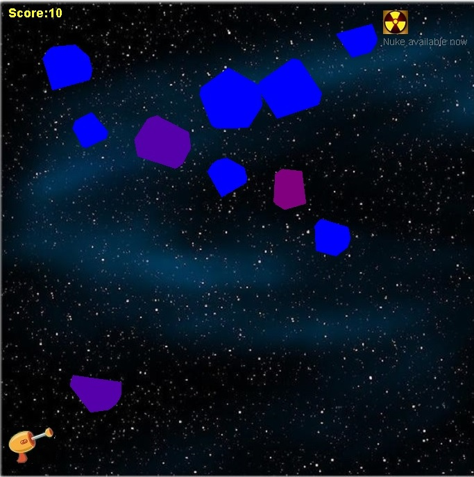
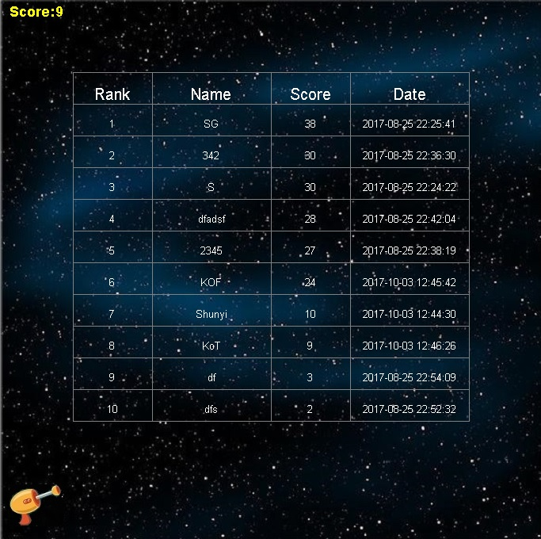

# Extinction-Level-Incident
Extinction-Level-Incident(ELI) is a small JApplet game just for fun. Eliminate the meteors by pressing on them with your mouse to save the world. When you get 10 meteors, you will win a nuclear bomb which you can use to erase all the meteors on screen. However, the game will evolve with more difficulty if you have used the nuclear bomb.

  
  

### Features
V1.0
* Basic functions:
  * random generated meteors
  * random falling speed
  * laser gun beam when pressed
  * nuclear bomb with flashing effect
  * sound effect 
* Highlights
  * random generated polygon as meteors shape
  * generate a rectangle instead of line as laser beam

V2.0
* Basic functions:
  * Restructure file orgnization
  * Using mysql with Spring JdbcTemplate to record user name and score
  * Display highest ten users/score when game over
* Hightlights:
  * Draw table and score on screen directly 

